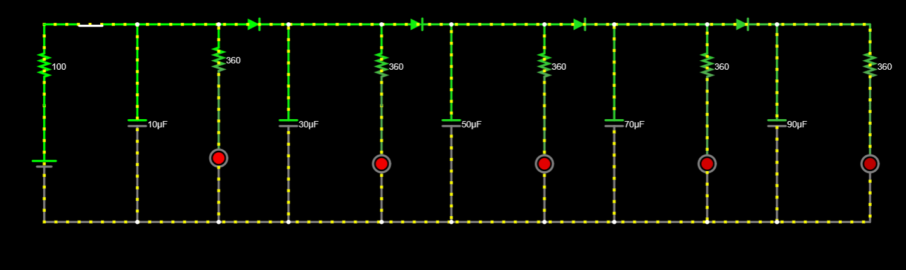

# Resolution-hardware
## Week-1 

For week 1, I built an RC LED circuit! Where 5 LEDs light up at the same time and fade in a small delay to create a cool effect!

## The Circuit  

  

The capacitors store charge, with the same resistor value for each LED. The larger the capacitor, the greater the delay is for the LED to fade!

