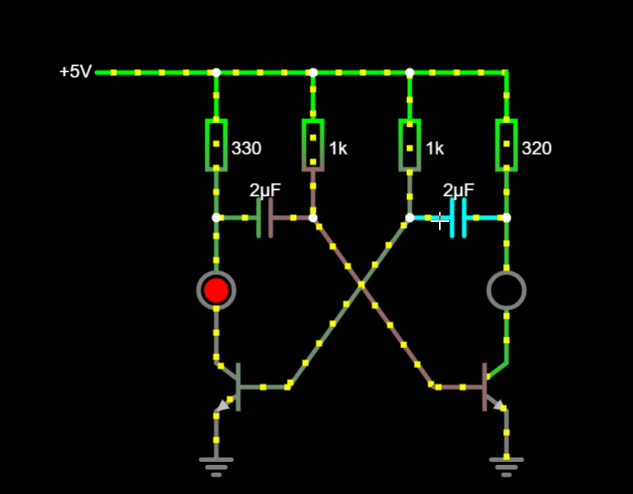
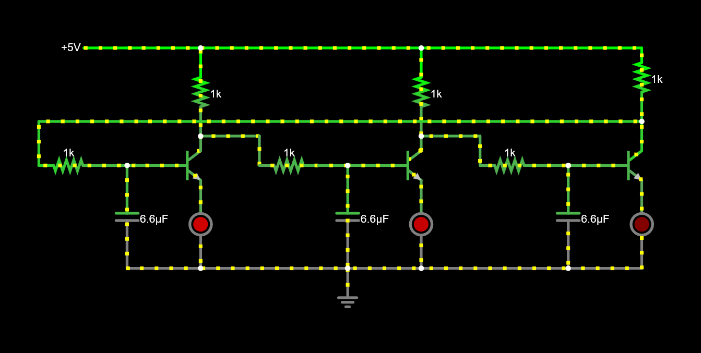
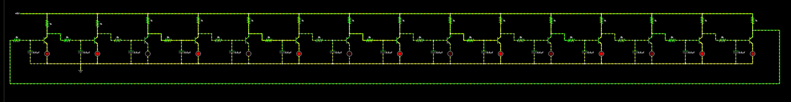
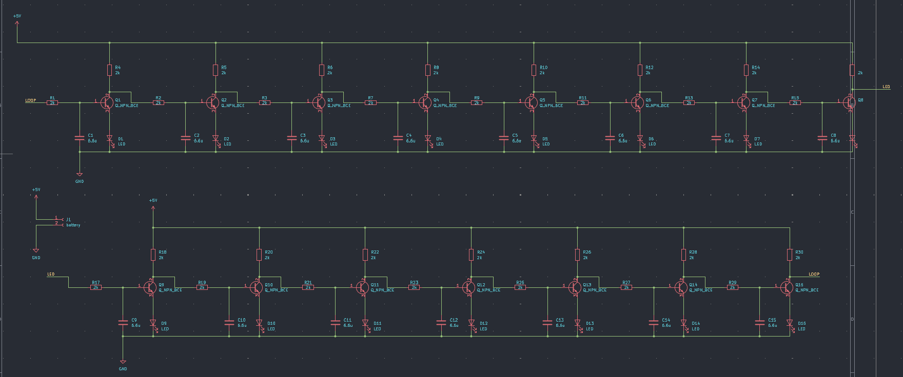
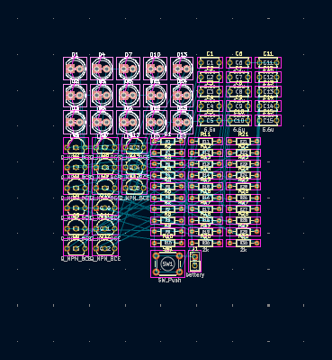
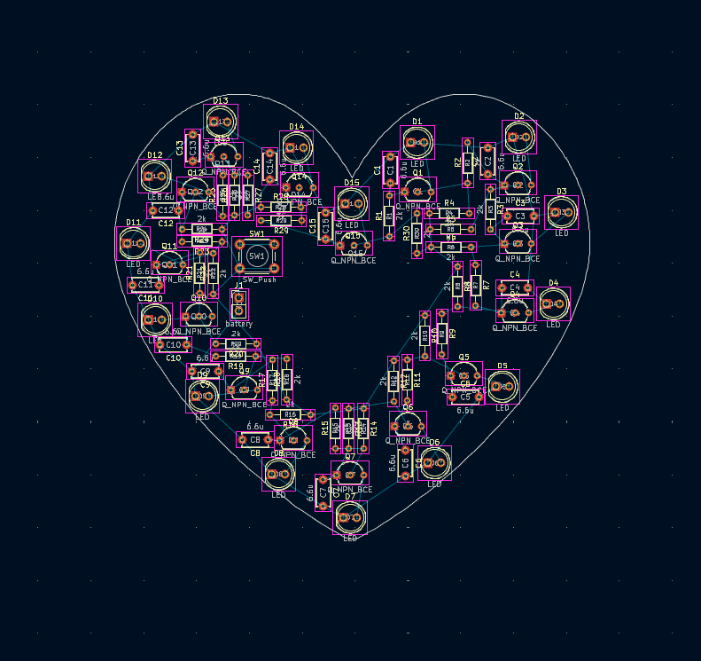
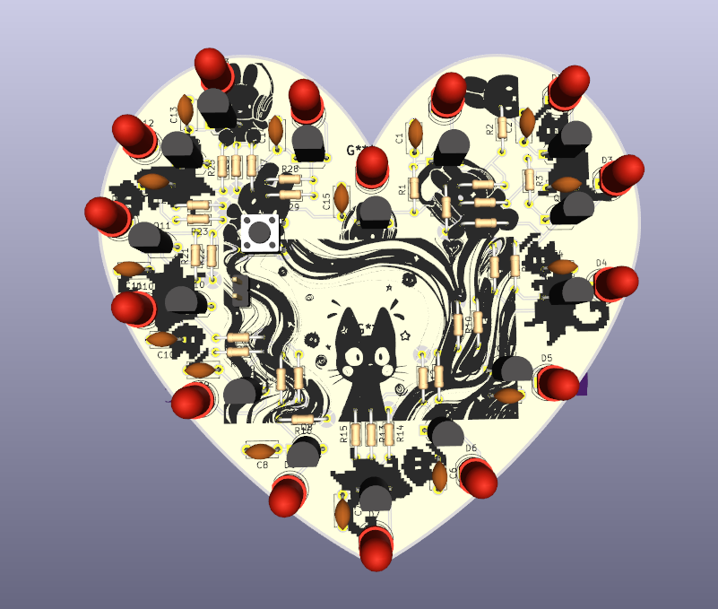
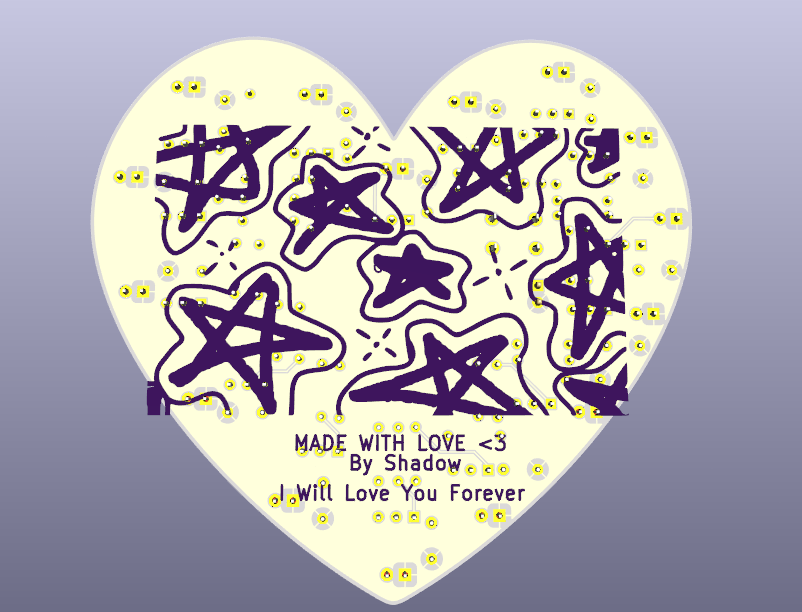

#### Hello! This will be my journal for the resolution-hardware week 2!
#### Total hours logged : 6h
By : Shadow 

---
## Project Idea :  LED Sequencer

I wanted to make a sequence of LEDs which light up in a sequence and keep repeating to make an infinite loop

----
### Learning through tutorial :-
### Time Spent : 1.5h
 I started by reading the [Week 2 guide](https://resolution.hackclub.com/app/pathway/hardware/week/2) and trying each circuit by myself figuring out how they work, during this the idea of astable multivibrator seemed fascinating, I will definitely make something using that in the future
 For now, these are the circuits which I made in falstad :
 

---
### Making the Circuit :-
### Time Spent : 1h 

I started making my circuit in falstad, at first it didn't work as expected to but after tweaking the values of resistors and capacitors, it looks good to me!

![[led.gif]]
Right now its just 3 LEDs , sequencing between each other, the first LED connects to the last one causing the circuit to run indefinitely.
I plan to make this of about 13 LEDs ( Since we need an odd number )

---

### Completed the circuit and schematics!
### Time Spent : 1h

I completed the circuit and increased it to 15 LEDs, due to slow circuit speed its not that visible
 

Then I started making the schematics in KiCAD

and assigned the footprints to all the components. Time to route the PCB!

---

### Completed the PCB!
### Time spent : 2.5h

If you have been reading all the journals, this would be the last journal 
I started making my PCB

This part took a while cause of routing all the components, for the PCB shape I decided to go with a heart shape and drew the heart shape myself in Inkscape!
Routing this took a lot of time indeed 

After completing the routings, I added some art on the PCB ( cause who likes blank PCB) and its done! I love my PCBs sm >.<

